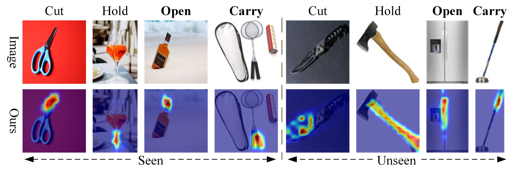

<div align="center">

# Generalizing Zero-Shot Robotic Grasping through One-Shot Open-Vocabulary Affordance Learning

[](https://opensource.org/licenses/MIT)

</div>

## 📖 Abstract

As robotic applications expand from structured industrial environments to unstructured domestic service domains, robots are required not only to recognize object categories but also to comprehend object affordance to facilitate effective interaction. Addressing the challenges inherent in traditional robotic grasping methods—specifically their heavy reliance on massive annotated datasets and confinement to closed-set vocabularies—this paper proposes a **"One-Shot Open Affordance Learning"** framework.

This framework integrates the **DINOv3** model, employed for extracting fine-grained visual features, with the **CLIP** model enhanced by **Context Optimization (CoOp)**. Through the introduction of a **CLS-Guided Transformer Decoder**, the system achieves a precise mapping from abstract semantic instructions to pixel-level affordance regions. Unlike methods requiring millions of training iterations, the proposed approach achieves lightweight training using **only one annotated example** in each base category and demonstrates robust zero-shot inference capabilities.

## 📊 Results & Visualization

The figure below demonstrates the model's capability to generalize affordance learning to both seen and unseen categories.

<div align="center">
  
  <br>
  <em>Figure 1: Qualitative results showing input images (top row) and generated affordance heatmaps (bottom row). The model accurately identifies regions for actions like "Cut", "Hold", "Open" and "Carry" across various objects.</em>
</div>

<br>

## 🚀 Usage

### Training
To train the model using the One-Shot setting:

```bash
python train.py

python demo.py \
  --img "path_to_image" \
  --model_file "path_to_trained_weights"
